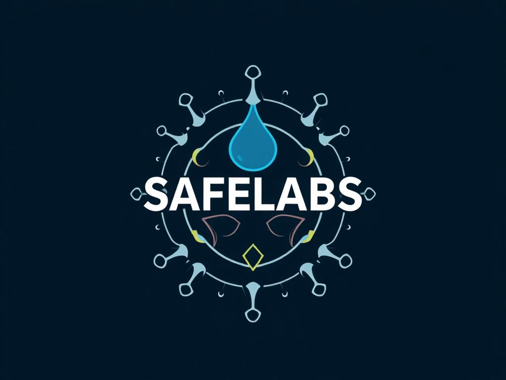
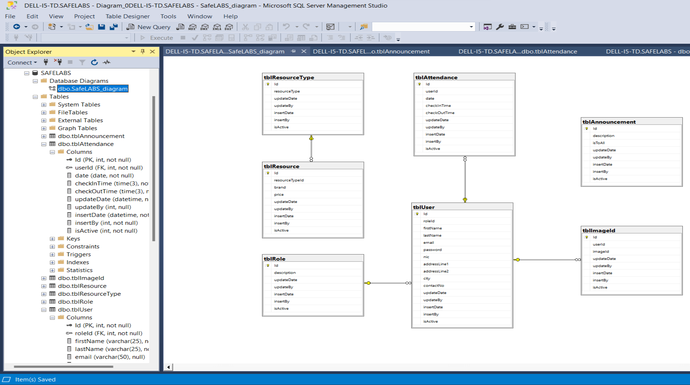

# 🔬 SafeLABS – Laboratory Management & Safety System



> A Smart Laboratory Management System that unifies facial recognition, PPE compliance, secure authentication, and efficient resource handling.

---

## 📁 Project Structure

```
SafeLABS/
│
├── backend/                   # Microsoft.NET Web API 
├── frontend/                  # React Frontend 
├── face-recognition/          # Python Face Recognition Module
├── ppe-detection/             # Python PPE Detection Module
├── Assets/                    # Contains diagrams
│   ├── database-diagram.png   # Database schema visualization
│   └── system-architecture.png  # Architecture diagram
├── DEMO/                      # Demo videos
│   ├── face-recognition-demo.mp4
│   ├── ppe-detection-demo.mp4
│   └── web-application-demo.mp4
├── Docs/                      # Documentation
│   ├── SafeLABS_Presentation.pdf
│   ├── SafeLABS_Mid_Progress_Review_Report.pdf
│   └── SafeLABS_Final_Report.pdf
├── SafeLABS_Database/         # Database scripts
│   └── SafeLABS_Database_Script.sql
├── safelabs-logo.png          # Logo for README
├── .gitignore                 # Git ignore file
└── README.md                  # This file
```

---

## 🚀 Features & Functionalities

### 🌐 Web App (React + .NET)

- 👤 **User Management**  
  Add, edit, or view users.
  
- 🔧 **Resource Management**  
  Add, update and track lab instruments and their usage efficiently.

- 📊 **Real-Time Lab Occupancy Tracking**  
  Uses face recognition to log check-ins and check-outs in real time.

- 📢 **Announcements Panel**  
  Display important notifications to users with Role-bAsed Access Control (RBAC).

- 👮 **Role-Based Access Control**  
  Grant or restrict access based on roles (Admin, Assistant, etc.).

- 🔒 **AES Encryption**  
  Protects sensitive user data (e.g., passwords) using strong encryption.

- 🔄 **Password Change + Error Handling**  
  Secure, user-friendly password update with real-time validations.

---

## 🧠 AI Modules

- 🧍‍♂️ **Face Recognition Module**  
  - Python + dlib based facial recognition for check-in authentication  
  - Integrates with MSSQL backend to mark attendance automatically
  - Integrates a pre-trained liveness detection model to prevent spoofing attempts

- 🦺 **PPE Detection Module**  
  - Uses OpenCV + YOLO v8 trained on CPPE-5 dataset for detecting lab coats (coverall), gloves, and masks  
  - Logs non-compliance instances or provides real-time alerts

---

## 🏗️ System Architecture


> A modular structure combining frontend (React), backend (.NET), AI modules (Python), and database (MSSQL).

---

## 🛠️ Tech Stack

| Layer         | Technology                         |
|--------------|-------------------------------------|
| Frontend      | React, Redux, Tailwind CSS          |
| Backend       | Microsoft .NET, C#                  |
| Database      | MSSQL Server                        |
| Face Recog.   | Python, dlib, OpenCV                |
| PPE Detection | Python, YOLO v8, OpenCV             |
| Security      | AES Encryption, Role-based Access   |

---

## 🗄️ Database Schema



> The database structure supports user management, resource management facial recognition, attendance tracking, and announcements.

---

## 🧃 Prerequisites

- [Visual Studio](https://visualstudio.microsoft.com/)
- [Python 3.9+](https://www.python.org/)
- [SQL Server & SSMS](https://learn.microsoft.com/en-us/sql/ssms/)

---

## 🛠️ Setup Instructions

### 1. Clone the Repo

```bash
git clone https://github.com/yourusername/SafeLABS.git
cd SafeLABS
```

### 2. Backend Setup

- Open `backend/` in Visual Studio
- Configure `appsettings.json` with correct MSSQL connection string
- Build & run the solution

### 3. Frontend Setup

```bash
cd frontend/
npm install
npm start
```

### 4. Database Setup

```bash
# Using SQL Server Management Studio (SSMS)
# Open and execute the script file:
./SafeLABS_Database/SafeLABS_Database_Script.sql
```

### 5. Face Recognition Module

```bash
cd Face_Recognition/
pip install -r requirements.txt
python main.py
```

### 6. PPE Detection Module

```bash
cd PPE detection/
pip install -r requirements.txt
python detection_model_v2.py
```

> The PPE detection uses YOLO v8 trained on the CPPE-5 dataset for accurate identification of lab safety equipment.

---

## 📹 Demonstrations

The project includes demonstration videos in the `DEMO/` folder:

- **Face Recognition Demo**: Shows the facial recognition system in action
- **PPE Detection Demo**: Demonstrates the PPE compliance monitoring system
- **Web Application Demo**: Walkthrough of the main web application interface

---

## 📑 Documentation

Comprehensive documentation is available in the `Docs/` folder:

- **SafeLABS_Presentation.pdf**: Project overview presentation
- **SafeLABS_Mid_Progress_Review_Report.pdf**: Mid-term progress report
- **SafeLABS_Final_Report.pdf**: Final project report with complete details

---

## 👨‍💻 Developer

Thithira Paranawithana  
Department of Computer Engineering
Faculty of Engineering
University of Sri Jayewardenepura 
📧 thithiradilmith15@gmail.com

---

## 📄 License

This project is intended for educational and academic demonstration purposes only.

---

## 🙌 Acknowledgements

Thanks to open-source contributors and frameworks that made this system possible.
